# OCRaaP

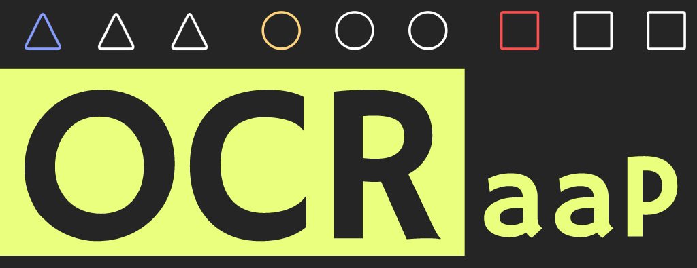

OCRaaP (Optical Character Recognition as a Program) is a handwritten, two-dimensional programming language designed for maximum ease of use and portability (all you need is some paper and a pen).

# Quick usage

You can run the example programs like so:

*While in the root directory,*

`python interpreter.py -i examples/helloWorld.jpg`

This will run the program and print any output. If the program requires input, it will halt and wait for you to enter a string in the terminal.

Alternatively, to debug a program, add the `-d` flag:

`python interpreter.py -i examples/helloWorld.jpg -d`

This will open up a window where you can step through the program. Simply press any key while the window is active to perform one execution step. Additionally, the current symbol, coordinate and stack values will be printed in the terminal.

# In this repo

In this repo you will find the following files and folders:

* `interpreter.py` - A CLI interpreter with a built-in debugger.

  * Run: `python interpreter.py -h` for options

* `model.py` - Represents the neural network classifier and provides an interface to facilitate prediction and training.

* `image_parser.py` - Performs symbol detection on a image.

* `generate.py` - A command line tool to help generate testing and training data for the classifier.

* `data_loader.py` - A tool to load and process images that the classifier will use for training or prediction.

# Overview

An OCRaaP program is first drawn on paper and then scanned in to the computer where it is fed into an interpreter.

The code pointer is a 2D projectile that moves around the paper and triggers operations upon encountering symbols similar.

Execution begins at `sad` and moves towards the nearest symbol. Once it reaches this symbol, it executes the operation and attempts to continue moving in the same direction towards the next nearest symbol within ~20 degrees of its current heading. If there is no nearby symbol, the code pointer will perform a "long jump" where it will attempt to move to the closest symbol that is directly along the current heading.

*Note: the user is advised to make the code path as clear as possible since the interpreter can be quite a pain in the ass*

When the code pointer reaches `Dead`, it halts execution.

Operations are conducted on an operand stack that holds unbounded integers.

# Examples

The following images are examples of valid OCRaaP programs:

| Name | Description | Program |
| --- | --- | --- |
| Hello World | prints the string `Hello World!` to the console |  |
| Echo | reads a string from the console and then prints it back |  |

# Symbols

### Global

| Symbol | Name | Description |
| --- | --- | --- |
| 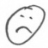 | `Sad` | The initial execution point of the program. If there are more than one of these, the program is invalid. |
| 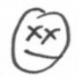 | `Dead` | Code execution stops here |
| 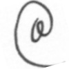 | `At` | Reads a character from the input stream and pushes it to the stack |
| 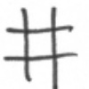 | `Hash` | Pops a character from the stack and writes it to the output stream |

### Conditional

| Symbol | Name | Description |
| --- | --- | --- |
| 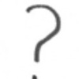 | `Conf` | Pops a value and checks if it is zero. If it is, code execution is deflected ~60 deg counter clockwise. Otherwise, code execution is deflected ~60 deg clockwise. |

### Constant

Constants can be pushed to the stack in binary notation termiated by a `Dollar`. Operands begin at the least significant bit.

For example, the following path of symbols would push 13 (0b1101) to the stack:

```
Dot -> Empty -> Dot -> Dot -> Dollar
```

Additionally, if no const symbols (`empty` or `dot`) have been encountered since the last constant was loaded, `dollar` will simply duplicate the topmost stack element.

| Symbol | Name | Description |
| --- | --- | --- |
| 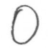 | `Empty` | Writes a binary 0 |
| 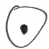 | `Dot` | Writes a binary 1 |
| 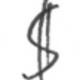 | `Dollar` | Terminates const loading and pushes result onto stack or duplicates topmost stack element |

### Arithmetic

| Symbol | Name | Description |
| --- | --- | --- |
| 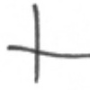 | `Plus` | pop b, pop a, push a+b |
| 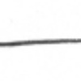 | `Dash` | pop b, pop a, push a-b |

# Errors

### 1x - Parse Time

| Code | Name | Description |
| --- | --- | --- |
| 10 | too sad | Found duplicate `sad` symbol |
| 11 | too happy | Could not find `sad` symbol |

### 2x - Runtime

| Code | Name | Description |
| --- | --- | --- |
| 20 | stack underflow | tried to pop from empty stack |
| 21 | already sad | tried to execute a `sad` symbol after start |

# How it works

### Classifier

The intepreter in this repository uses a convolutional neural network classifer that was trained using TensorFlow on a few dozen of each symbol. Training symbols were generated in every orientation so the classifier should be rotation invariant. It reached about `97%` accuracy on a separate validation set.

*Note: users are advised to draw symbols with great precision so as not to confuse the classifier*

The network structure is as follows:

```
INPUT: 40x40x1 grayscale images

Convolutional Layer 1: 40x40x6 (kernel: 6x6, stride: 1)
Convolutional Layer 2: 20x20x12 (kernel 5x5, stride: 2)
Convolutional Layer 3: 10x10x24 (kernel 4x4, stride: 2)

Fully Connected + dropout: 200

Softmax Output: 10
```

Training is done in batches of 200 using TensorFlow's implementation of the [Adam Optimizer](https://www.tensorflow.org/api_docs/python/tf/train/AdamOptimizer) to minimize cross entropy.

*during training, pkeep for the fully connected + dropout layer is set to 0.75*

### Training Data

In order to generate training and testing data, you can use the `generate.py` CLI which will perform segmentation on an input image and allow you to discard symbols that were segmented incorrectly.

For example, the following image (from `source/`) was used to generate training data for the `dollar` symbol:

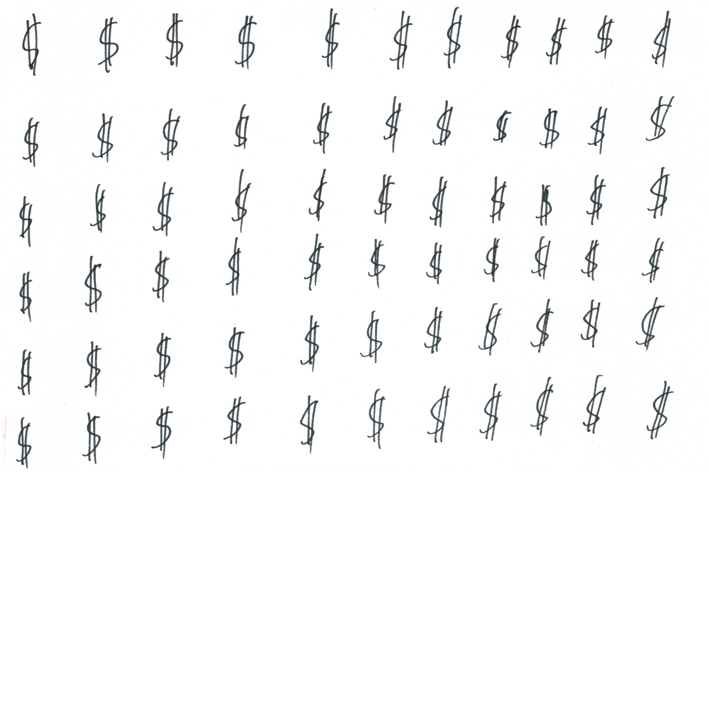

The script will then crop each symbol to  and generate an image at each 15 degree rotation like so:

|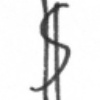|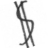|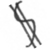|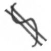||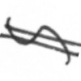|
|---|---|---|---|---|---|
|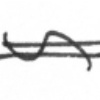|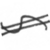|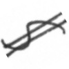|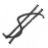|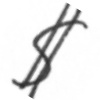||
|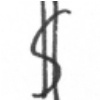|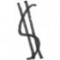|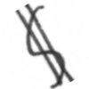|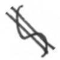|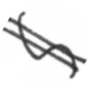|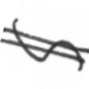|
|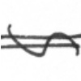|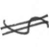||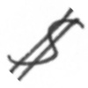|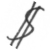|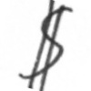|
